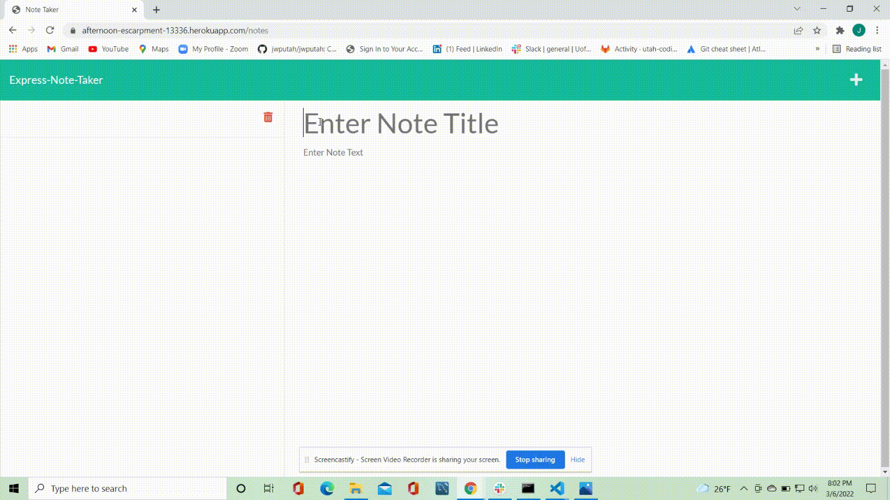

# Express-Note-Taker

--------

--------

## This is an application called Express-Note-Taker that can be used to write and save notes. The application uses Express.js back end to save and retrieve note data from a JSON file.

****
****

### Table of Contents
* [Install](#installation)
* [Usage](#usage)
* [Contributing](#contributing)
* [Test](#test)

* [Questions](#questions)

****
****

#### Installation
Clone the repo from github and run node server.js from the intergrated terminal.

----

#### Usage
Visit the deployed application here. [Heroku Link](https://afternoon-escarpment-13336.herokuapp.com/)

----

#### Contributing
The app.delete function was acquired from [www.tabnine.com](https://tabnine.com)

NPM Packages
* Generate Unique ID
* Express.js

----

#### Test
No tests were developed for this application.

----

****
****

#### Questions
Any questions? You can contact me directly at jwputah7@gmail.com

Or visit my 
